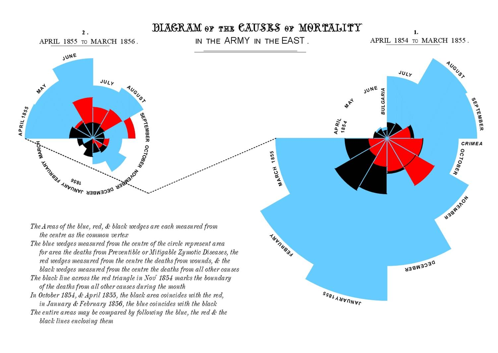

# (PART) Module 02 {-}

# Plotting with **ggplot2**

Set up the workspace:

```{r setup}
# Load required packages
library(tidyverse) # loads ggplot2 and other tidyverse packages
library(gapminder) # loads the gapminder dataset

# Set a default figure size
knitr::opts_chunk$set(fig.width = 5, fig.height = 4, fig.align = "center")
```

## Learning Objectives

By the end of this lesson, you will be able to:

- Have a sense of why we're learning **ggplot2**
- Understand the importance of statistical graphics in communicating information
- Identify the components of the grammar of graphics underlying **ggplot2**
- Use different geometric objects and aesthetics to explore various plot types

## Resources

Here are some good walkthroughs that introduce **ggplot2**:

- [r4ds: data-vis](http://r4ds.had.co.nz/data-visualisation.html) chapter.
- The [ggplot2 book](http://webcat2.library.ubc.ca/vwebv/holdingsInfo?bibId=8489511), Chapter 2
- [Jenny Bryant's **ggplot2** tutorial](https://github.com/jennybc/ggplot2-tutorial)
- [Andrew Heiss's data visualization course](https://datavizs21.classes.andrewheiss.com/)

Here are some good resource to use as a reference:

- [**ggplot2** cheatsheet](https://github.com/rstudio/cheatsheets/blob/master/data-visualization-2.1.pdf)
- [R Graphics Cookbook](http://www.cookbook-r.com/Graphs/)

# Plotting in R

TL;DR: We're using **ggplot2** in progdata.

R has several frameworks for building graphics.
One of the earliest advantages when R (and its predecessor S) were introduced in the 1980s was its professional plotting capabilities.

However, the "base R" plotting methods, mostly accessed using the `plot()` function, can be involved, and requires a lot of "drawing by hand". 

That said, for simple "quick looks" at data, base R plots can be useful:

```{r}
plot(airquality[,1:4])
```

The most widely used modern plotting tool in R is **ggplot2**, 
which provides a very powerful framework for making plots. 
It has a theoretical underpinning, too, based on the Grammar of Graphics, first described by Leland Wilkinson in his 
["Grammar of Graphics" book](http://resolve.library.ubc.ca/cgi-bin/catsearch?bid=5507286). 
With **ggplot2**, you can make a great many type of plots with minimal code. 
It's been a hit in and outside of the R community.

  - A big advantage of **ggplot2** is that many people have written extensions for
    it, such as [**ggdist**](https://mjskay.github.io/ggdist/articles/slabinterval.html) (for plotting distributions and intervals),
    [**gganimate**](https://gganimate.com/) (for animations and GIFs),
    [**plotly**](https://plot.ly/) for interactive graphs, and
    [**see**](https://easystats.github.io/see/) (ready-built visualizations for many models).


## Just Plot It

The human visual cortex is a powerful thing. 
If you're wanting to point someone's attention to a bunch of numbers, 
you probably won't get any "aha" moments by displaying a large table [like this](https://i.stack.imgur.com/2JdLt.png), 
either in a report or (especially!) a presentation. 

Make a plot to communicate your message!

Florence Nightingale was a pioneer in many fields (e.g., nursing, sanitation, public health, statistics). Her contributions to statistics (a field generally prohibited to women in her era) were centered around communicating data using visualization.


During the Crimean Wars, she convinced the British military to implement a variety of sanitation measures through effective and innovative data visualization.



If you really feel the need to tell your audience every number exactly, consider putting your table in an appendix.
Because chances are, the reader doesn't care about the exact numeric values. Or, perhaps you just want to point out one or a few numbers, in which case you can put that number directly on a plot.
