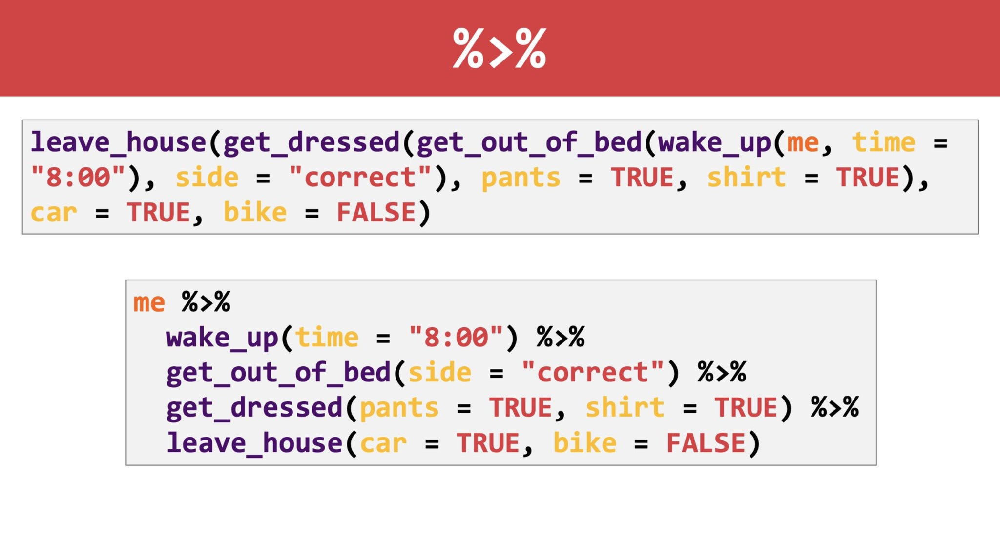

# The pipe advantage

## Learning Objectives

By the end of this lesson, you will:

- Have a sense of why **dplyr** is advantageous compared to the "base R" way with respect to good coding practice.

Why?

- Having this in the back of your mind will help you identify qualities of and produce a readable analysis.

## Compare nested functions to pipe chains

__Self-documenting code__. 

This is where the tidyverse shines.

Example of **dplyr** vs base R:

```
gapminder[gapminder$country == "Cambodia", c("year", "lifeExp")]
```

vs.

```
gapminder |>
  filter(country == "Cambodia") |>
  select(year, lifeExp)
```



## The workflow:

1. Wrangle your data with **dplyr** first
   - Separate steps with `|>`
2. Pipe `|>` your data into a plot/analysis

## Basic principles:

1. Do one thing at a time
  - Transform variables OR select variables OR filter cases
2. Chain multiple operations together using the pipe `|>` 
3. Use readable object and variable names
4. Subset a dataset (i.e., select variables) by **name**, not by "magic numbers"
5. _Note that you need to use the assignment operator `<-` to store changes!_

## Tangent: Base R workflow

We are jumping right into the tidyverse way of doing things in R, 
instead of the base R way of doing things. 
Our first week was about "just enough" base R to get you started. 
If you feel that you want more practice here, 
take a look at [the R intro stat videos by MarinStatsLectures](https://www.youtube.com/playlist?list=PLqzoL9-eJTNARFXxgwbqGo56NtbJnB37A).
