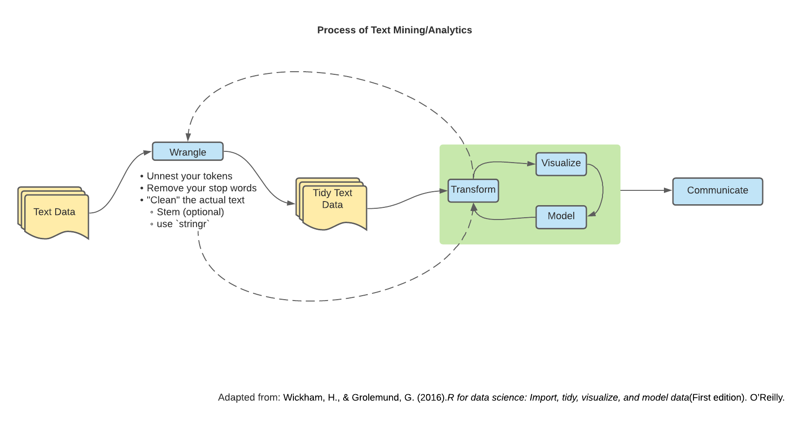

# (PART) Module 07

Guest chapter by Wesley Gardiner.

```{r}
library(tidyverse)
library(tidytext)
library(textdata)
```


# Text Data

## Wrangling

We've been working primarily with numerical-based data. 
However, we might also be interested in text-based data. 
This field of study is called Natural Language Processing (NLP).

Keeping in scope with the class being "How do we wrangle/program with our data?" we will go over how to wrangle and shape text-based data as well as some metrics to measure important words.



The primary package we will be using to wrangling is the `tidytext` package. 
Another useful package for text (or string) manipulation is the `stringr` package.

## Natural Language Processing (NLP) - Terminology

In your journey of NLP, you might stumble across different terms used and it's important to get familiar with them so we can start formulating our ideas and expressing our questions with the terminology.

-   *Corpus* - A broad collection of documents

    -   Plural: *Corpora*

-   *Document* - A collection of terms

-   *Terms* - Words

-   *Tokens* - The unit of the analysis (words, characters, sentence, paragraph, n-grams, etc.)

    -   Changes meaning based off what we are wanting to analyze
    -   We *tokenize* our data; the process of splitting text into tokens

Read more about other key terms [here](https://www.kdnuggets.com/2017/02/natural-language-processing-key-terms-explained.html).

# The mighty `unnest_tokens()` function

Lets look at an example of some text:

```{r}
text <- c("Today and only today is a lovely day to learn about text data and NLP",
          "I hope that one day I will be able to apply all of what I learn because learning if cool and fun",
          "If I were to express my feelings in two words: excitement and anxious")

text
```

Now let's put it into a data frame structure:

```{r}
text_df <- tibble(
  line = 1:3,
  text = text
)

text_df
```

## Tidy ~~data~~ text principles

The "tidy data" principles apply to text data as well!

We want our data to have **one-token-per-document-per-row.** In our case, tokens are individual words.

The main three arguments of `unnest_tokens()` look like this:

    unnest_tokens(data_frame, new_name_of_column, column_name_in_data_frame)

or

    data_frame |>
      unnest_tokens(new_name_of_column, column_name_in_data_frame)

Let's take a look at what that looks like:

```{r}
unnest_df <- 
  text_df |> 
  unnest_tokens(word, text)

unnest_df
```


I'm sure you've noted a few things about our text from using `unnest_tokens()`

-   Our words are split into a word-per-row

-   We have a way of identifying from which document (`line`) our words come from

-   Our words are...lower case?

# Clean your text! Grammar vs. Computers

In English (and broadly all language), we have grammar. Computers don't. This has big implications.

We need to make sure that we capture our words (or tokens) as *we* understand them. Computers don't know that "Capital Word" is the same thing as "capital word". They also don't know that "running" is the same idea as "run".

I'm sure you already have thought of practical solutions to some of these problems and guess what? We do exactly that.

## Capitalization

This one's pretty easy: we make all our text the same format. Usually lowercase is the format of choice. I like lowercase because then I'm not being yelled at.

`unnest_tokens()` automatically makes words lowercase. We can change that by specifying `to_lower = FALSE`. (In the case we are working with URLs.)

## Stemming

For words that have the same "stem" (or root) we can remove the end.

Example:

These words:

-   Consult

-   Consultant

-   Consultants

-   Consulting

-   Consultative

Become:

-   Consult

We can specify this in `unnest_tokens()` with `token =` argument. Look at `?unnext_tokens()` to see the different types of tokens the function offers.

These grammar vs. computer problems don't stop here (nor do their solutions).

## Regular Expressions (Regex) for URLS

Depending on the text data we are working with, we might either be interested (or not interested) in URLs. Using regular expressions, we can try and detect URLs within our text. Regular expressions are a whole other beast so to keep in scope with the class, here is one example of a regular expression for URLs with a little explanation.

    (http|https)([^\\s]*)

-   The `(http|https)` looks for "http" or "http" at the start of a string.

-   The `([^\\s]*)` means "keep matching until a white space"

Using `stringr` we can select different `str_*` functions to aid in our goal.

Here are a list of texts that have a URL in different places within the string.

```{r}
url_front <- c("https://regex101.com/ is an awesome website to check out different regular expressions")
url_middle <- c("One of my friends suggested I look at https://www.youtube.com/watch?v=dQw4w9WgXcQ for a good tutorial on regular expressions")
url_back <- c("Here is a good resource on regex: https://stackoverflow.com/questions/tagged/regex")

urls <- c(url_front, url_middle, url_back)
```

We can create functions to help us do it!

```{r}
remove_url <- function(text) {
  # Regex
  url_regex_expression <- "(http|https)([^\\s]*)"
  
  # Removes URL
  text <- stringr::str_remove(
    string = text,
    pattern = url_regex_expression
  )
  
  return(text)
}

extract_url <- function(text) {
  # Regex
  url_regex_expression <- "(http|https)([^\\s]*)"
  
  # Extracts URL
  text <- stringr::str_extract(
    string = text,
    pattern = url_regex_expression
  )
  
  return(text)
}
```

Putting it all together can call the function either on each individual string... 

```{r}
# Individual URL matching
remove_url(url_middle)
extract_url(url_middle)
```

...or within a list like so:

```{r}
# Group URL matching
remove_url(urls)
extract_url(urls)
```

## Counting words

Now that we have our tidy text data frame, we can start digging in.

Let's add a count of each word:

```{r}
unnest_df |> 
  count(word, sort = TRUE)
```

But lets work within our sentences (or documents)

```{r}
count_df <- 
  unnest_df |> 
  group_by(line) |>
  count(word, sort = TRUE)
count_df
```

Lets look at a (not) very interesting graph of what we have:

```{r}
library(ggplot2)

count_df |> 
  ggplot() +
  aes(y = n, x = forcats::fct_reorder(word, n, max)) + # sort our bars
  geom_col() +
  coord_flip() + # flip the coords (easier to digest graph)
  facet_wrap(~ line, scales = "free_y") + # let our y axis be free
  labs(y = "word",
       x = "count")
```

From the graph above, we can see that we have a lot of words that don't really carry a lot of meaning.

## Can't stop (words) won't stop (words)

Not all words are created equal - some words are more important than others. Words like "the", "a", "it" don't have any inherent meaning. Pronouns also may not be meaningful "he", "their", "hers". These are called **stop words**

So what do we do? Get rid of 'em.

How? We get a stop words data set and `anti_join()` them. There exists many stop word data sets. These are sometimes called "Lexicons". You can think of a lexicon as a set of words with a common idea.

## Lexicon-based approach

Some common (and native) stop word data sets (or Lexicons) are:

-   Onix

-   SMART

-   snowball

These are all within the `tidytext` package's `stop_words` data set.

This is a glimpse of what it looks like:

```{r}
tidytext::stop_words |> 
  head()
```

Now let's remove our stop words.

```{r}
unnest_df <- 
  count_df |> 
  anti_join(stop_words, by = "word")
```

Here we can see our words with substance.

```{r}
unnest_df |> 
  ggplot() +
  aes(x = word, y = n) +
  geom_col() +
  facet_wrap(~ line, scale = "free_y") + 
  coord_flip()
```

# Case Study: Martin Luther King Jr.'s Speech

We are going to look at Martin Luther King Jr.'s "I Have a Dream" speech found [here](https://www.americanrhetoric.com/speeches/mlkihaveadream.htm).

Lets read it in. Since it's in a `.txt` file we can use `read.table()` and specify some things:

```{r include=FALSE}
library(tidyverse)
```

```{r}
speech_txt <- read.table(
  here::here("data", "martin_luther_king_speech.txt"),
  quote = "",
  header = FALSE,
  sep = "\n",
  stringsAsFactors = FALSE
) |> 
  as_tibble() |> 
  rename(line = V1)
```

## Wrangle our text

### `unnest_tokens()`

Wielding the power of `tidytext`:

```{r}
speech_unnest <-
  speech_txt |> 
  unnest_tokens(word, line)

speech_unnest
```

### Remove stop words

```{r}
speech_unnest <-
  speech_unnest |> 
  anti_join(stop_words, by = "word")

speech_unnest
```

### Count the words

```{r}
speech_unnest <-
  speech_unnest |> 
  count(word, sort = TRUE)

speech_unnest
```

## Visualizing the words

```{r}
speech_unnest |>
  filter(n >= 4) |> # look at words that only occurred 4 or more times
  ggplot() +
  aes(y = n, x = forcats::fct_reorder(word, n, max)) + # sort our bars
  geom_col() +
  coord_flip() + # flip the coords (easier to digest graph)
  labs(y = "word",
       x = "count")
```

---

# Mining

Now that we have gone over how to wrangle/shape our data, it's time to talk about some useful quantitative measure of text that help us get a better understanding of whats going on within our text.

## Sentiment Analysis

Feeling is a big part of communication. Some words have different emotions/feelings behind them. That may be a interest of ours when looking at text.

One simple approach we can take is simply having a list of a bunch of words labeled with different emotions. We treat our text as a **bag-of-words** and just match words to a dataset with those word and sentiment. This is a lexicon-based approach (similar to stop words lexicon based approach).

There exists different lexicons with different ways of expressing sentiment. We are going to look at some lexicons found in the `textdata` package that work nice within `tidytext`.

`textdata` lexicons:

-   [Bing](https://emilhvitfeldt.github.io/textdata/reference/lexicon_bing.html): Expresses words in a binary positive or negative fashion

    -   Positive or negative

-   [AFINN](https://emilhvitfeldt.github.io/textdata/reference/lexicon_afinn.html): Expresses words with a value (-5 to 5) according the the word's valence

    -   -5 to 5

-   [NRC](https://emilhvitfeldt.github.io/textdata/reference/lexicon_nrc.html): Expresses words with the following sentiments:

    -   Negative
    -   Positive
    -   Anger
    -   Anticipation
    -   Disgust
    -   Fear
    -   Job
    -   Sadness
    -   Surprise
    -   Trust

### Looking at our Lexicons

Using the `tidytext::get_sentiments()` function we can take a peek at the words within. We'll stick to manually reading it in as a `.csv` to practice our skills.

#### Bing - Positive vs. Negative

```{r}
bing <- read.csv(here::here("data","bing_dictionary.csv"))
```

```{r}
bing |> 
  dplyr::count(sentiment)
```

Here we can see how many words are positive and negative within our lexicon

#### AFINN - Words on a -5 to 5 scale

```{r}
afinn <- read.csv(here::here("data","afinn_dictionary.csv"))
```

```{r}
afinn |>
  mutate(value = as_factor(value)) |> # make our value a factor
  ggplot() +
  aes(x = value) +
  geom_histogram(stat = "count") # tell ggplot to count()
```

From the above plot we can get a picture of the count of each value. In other words, we see that we have a lot of words with a -2 rating.

If we wanted specific counts we can `count()` the `value` ourselves

```{r}
afinn |> 
  mutate(value = as_factor(value)) |> 
  count(value)
```

#### NRC - Anger, Anticipation, ...

```{r}
nrc <- read.csv(here::here("data","nrc_dictionary.csv"))
```

This lexicon has multiple representations of a word with different sentiments

The word "abandon" has "fear","negative","sadness" attached to it.

Let's get a *feel* (ba-dum-tsh) for our lexicon:

We can see our unique words `count()`ing them:

```{r}
nrc |> 
  count(word) |> # automatically collapse the same word
  nrow()
```

Here we can see how many different sentiments are attached to each word.

```{r}
nrc |> 
  count(sentiment) |> 
  ggplot() +
  aes(x = sentiment, y = n) +
  geom_col()
```

### Using `inner_join()` with our `bing` lexicon

Let's revisit our `unnest_df` from earlier

```{r}
unnest_df |> head()
```

Using `inner_join()` we can match words from our lexicon to our data.

**Note**: Remember to have the same column name as both your data and lexicon for the words.

```{r}
unnest_df |> 
 inner_join(bing, by = "word")
```

From the above output we can see that line 2 had 2 positive words while line 3 had a mix of 1 positive word and 1 negative word.

### Important things with sentiment analysis

Now there are a couple things to consider when deciding on which lexicon to use other than just the depth/type of sentiment we want to look at.

Here are a some questions to keep in mind:

-   What was the lexicon developed for?

    -   Reviews?

    -   Tweets?

-   How was the lexicon developed?

    -   Through researchers?

    -   Crowd sourced?

-   How old is the lexicon?

    -   Words change meaning over time

    -   Culture of the words used?

Another thing to consider is that lexicon sentiment analysis is a **bag-of-word** type of analysis. Context isn't considered when looking at words. If you're interested in looking at different techniques look into [n-grams](https://www.tidytextmining.com/ngrams.html)

## Metrics of Text

Let's dig into some quantitative measures of text data. Two main metrics we will consider in this chapter are:

-   TF-IDF

-   Weighted log-odds ratio.

### Term-Document Inverse Document Frequency (TF-IDF)

TF-IDF stands for Term-Document Inverse Document Frequency. It's main goal is to measure how "important" a word is in our corpus (Silge & Robinson, 2017). TF-IDF is useful when we want to understand the terms in the corpus as a whole.

Let's break down TF-IDF into it's two parts:

-   Term-frequency: How many times a term/word occurs?

-   Inverse-Document Frequency: The inverse of the number of times a word shows up in a collection of documents.

$$
idf(term) = ln(\frac{n_{documents}}{n_{documents\ containing\ terms}})
$$

This is based off of the idea that the more a term shows up, the less important that term is.

#### Zipf's Law

TF-IDF is inspired by George Zipf's law.

Zipf's law states the following:

> the frequency that a word appears is inversely proportional to its rank.

This makes sense if we think about how language is. We would expect words that don't show up often to carry more weight and be more important than words that show up all the time.

#### Example

Let's calculate the TF-IDF with `bind_tf_idf()`

We need our data set to have one-row per document-term:

```{r}
tidy_df <-
  unnest_df |> 
  count(line, word, sort = TRUE)

tidy_df |> head()
```

Now we can `bind_tf_idf()`

```{r}
tidy_tf_idf_df  <- 
  tidy_df |> 
  bind_tf_idf(word, line, n)

tidy_tf_idf_df
```

We can see the top TF-IDF words are: "words", "feelings", "express", "excitement", and "anxious" while our lowest are "learn" and "day."

#### Visualize TF-IDF

```{r}
tidy_tf_idf_df |> 
  ggplot() +
  aes(x = fct_reorder(word, tf_idf), # order `word` by `tf_idf`
      y = tf_idf,
      fill = as_factor(line)) + # color :-)
  geom_col() +
  coord_flip() + 
  facet_wrap(~ line, scales = "free_y") + 
  labs(x = "",
       fill = "Line #")
```

Above we get a nice graph of our words and their TF-IDF.

### Weighted Log-odds

Sometimes we are interested in comparing words between different groups within a corpus. Here are some examples:

-   Corpus of scientific articles from different fields (e.g., economics, medicine, technology):

    -   What words are you most likely to see given the field?


-   Corpus of two twitter users:

    -   What words are you more likely to see from each user?


-   Corpus of a collection of products and their respective reviews:

    -   What words are you more likely to see from each product/rating?


-   Corpus of different baby's names from different time periods (1960s, 1970s, ...)

    -   What names were most prevalent in each year compared to other years?


To do this we can use the weighted log-odds ratio. Let's break down what "weighted log-odds ratio" means.

#### Odds Ratio

Odds ratio, simply, is the ratio of something happening divided by that thing not happening.

$$
Odds\ Ratio = \frac{x\ happening_{1960s}}{x\ not\ happening_{1960s}} \div \frac{x\ happening_{other}}{x\ not\ happening_{other}}
$$

This is different from probability. Probability can be thought of the ratio of x happening with *all* possible happenings.

#### Log-odds ratio

The log-odds ratio is just the odds ratio with a log transformation (natural log).

Reason being, it allows for some pretty nice behavior like:

-   Symmetry around zero

-   Transforms our range to be between $[-\infty, \infty]$

$$
log(Odds\ Ratio) = log(\frac{x\ happening_{1960s}}{x\ not\ happening_{1960s}}) - log(\frac{x\ happening_{other}}{x\ not\ happening_{other}})
$$

#### Weighted log-odds ratio

The `bind_log_odds()` function fits a posterior log odds ratio assuming a multinominal model with a Dirichlet prior. (See `?bind_log_odds` for more info)

To look into the actual method behind the function see [Monroe, Colaresi & Quinn 2007](https://www.cambridge.org/core/journals/political-analysis/article/fightin-words-lexical-feature-selection-and-evaluation-for-identifying-the-content-of-political-conflict/81B3703230D21620B81EB6E2266C7A66)

### Example

Using `bind_log_odds()` we can specify different arguments to tweak our output.


```{r}
library(tidylo)

# from earlier:
# tidy_df <-
#   unnest_df |> 
#   count(line, word, sort = TRUE)


log_odds_df <- 
  tidy_df |> 
  bind_log_odds(line, word, n,
                uninformative = TRUE, # TRUE = Do not fit with a Dirichlet Prior 
                unweighted = TRUE) # TRUE = Add a unweighted column
```

#### Visual

We can now visualize the different weighted log odds for each line

```{r}
log_odds_df |> 
  ggplot() +
  aes(x = fct_reorder(word, log_odds_weighted), y = log_odds_weighted, fill = as_factor(line)) +
  geom_col() +
  coord_flip() +
  facet_wrap(~ line, scales = "free_y") +
  labs(x = "",
       fill = "Line #")
```

## Case Study 2: Reviews on Product

Below we are going to look at different reviews on Amazon for candles. 

Let's read in our dataset.

```{r}
# library(tidyverse)
# library(tidytext)

scented_reviews <-
  readxl::read_excel(here::here("data", "Scented_all.xlsx")) |>
  mutate(review_id = row_number()) |>
  janitor::clean_names() |> # A function that changes the column names to snake_case/cleans them up a little
  mutate(rating = as_factor(rating)) 
```

### Clean Text

First step is to `unnest_tokens()` our reviews.

```{r}
unnest_scent <-
  scented_reviews |>
  unnest_tokens("word", "review",
    token = "words"
  )
```

### Remove Stop-words

We then remove our normal stop words.

```{r}
unnest_scent <-
  unnest_scent |>
  anti_join(stop_words, by = "word")
```

### Removing Custom Stop-words

Usually there are words that we know are more "noise" than "signal". In order to determine if a word is "noise" we can implement different strategies.

One strategy is to look through all unique words and skim to find one's not offered in the stop words lexicon already.

```{r}
unnest_scent |>
  distinct(word) |>
  head()
```

Another strategy is to look at the most frequent words and determine if the word is useful or not.

```{r}
unnest_scent |>
  count(word) |>
  arrange(desc(n)) |>
  head()
```

Now once we decide which to remove we can put it together in a `tribble()`

```{r}
custom_stopwords <-
  tribble(
    ~word,       ~lexicon,
    "candle",    "custom",
    "candles",   "custom",
    "smell",     "custom",
    "smells",    "custom",
    "scent",     "custom",
    "fragrance", "custom",
    "yankee",    "custom",
    "love",      "custom", # This word shows up so much it acts like a stop word
    "sooo",      "custom", # This is an example of using text from the internet
    "soooo",     "custom",
    "doesn",     "custom",
    "don",       "custom"
  )
```

We use the same method to remove our `custom_stopwords` as we do with regular ol' `stop_words`

```{r}
unnest_scent <-
  unnest_scent |>
  anti_join(custom_stopwords, by = "word")
```

#### Remove Numbers/Non-alphabet characters

Depending on the type of data you're working with there might be more than just characters you need to remove. Since we're working with data from an online source, there are some weird characters that appear as well as digits used. Using the `stringr` package, we can clean it up.

```{r}
unnest_scent <-
  unnest_scent |>
  mutate(word = str_replace(word, pattern = "[^\x20-\x7E](.*)", replacement = "")) |> # Remove weird characters
  filter(
    !str_detect(word, "[0-9]+"), # Remove digits
    word != ""
  )
```

#### Removing words that only show up < 10 times.

A common way to reduce the amount of noise within a corpus is to focus on words that show up more than `n` number of times.

```{r}
unnest_scent <-
  unnest_scent |>
  add_count(word, name = "n_total") |>
  filter(n_total >= 10)
```


### Word Frequency

### Sentiment analysis

Let's get a *feel* for our data (someone stop me, I'm on a roll).

We are going to work with the BING and NRC lexicons.

#### BING

*Just a reminder, BING uses a positive/negative coding of each word.*

```{r}
bing <- read.csv(here::here("data","bing_dictionary.csv"))
```

```{r}
bing_scent <-
  unnest_scent |>
  inner_join(bing, by = "word")
```

##### Overall

```{r}
bing_scent |>
  count(sentiment) |>
  ggplot() +
  aes(
    x = sentiment, y = n,
    fill = sentiment
  ) +
  geom_col() +
  labs(
    title = "Overall BING Sentiment of Customer Reviews",
    y = "Number of Words"
  )
```

According to the graph above, overall we have a lot more positive words than negative ones within our reviews.

##### By Rating

Now it might be useful to know how the number of positive and negative words change within each rating given.

```{r}
bing_scent |>
  group_by(rating) |>
  count(sentiment) |>
  ggplot() +
  aes(x = sentiment, y = n, fill = sentiment) +
  geom_col() +
  facet_wrap(~rating, scales = "free") +
  labs(
    title = "BING Sentiment of Customer Reviews by Rating",
    y = "Number of Words"
  )
```

Intuitively, we expect for an inverse relationship between the rating and number of positive/negative words. To put another way, we expect people who rate the candle lower to express/use more negative sentiment/words

#### NRC

*Reminder: NRC codes words with different emotions.*

```{r}
nrc <- read.csv(here::here("data","nrc_dictionary.csv"))
```

```{r}
nrc_scent <-
  unnest_scent |>
  inner_join(nrc, by = "word")
```

##### Overall

Let's take a peek at the over amount of sentiment expressed within our reviews.

```{r}
nrc_scent |>
  count(sentiment) |>
  ggplot() +
  aes(x = fct_reorder(sentiment, n), y = n, fill = sentiment) +
  geom_col() +
  labs(
    title = "Overall NCR Sentiment of Customer Reviews",
    y = "Number of Words",
    x = "Sentiment"
  )
```

Similar to our BING analysis, we have a higher use of positive-type words than negative.

##### By Rating

Again, its useful to take it within the context of what the review had in rating.

```{r}
nrc_scent |>
  group_by(rating) |>
  count(sentiment) |>
  ggplot() +
  aes(x = fct_reorder(sentiment, n), y = n, fill = sentiment) +
  geom_col() +
  facet_wrap(~rating, scales = "free") +
  labs(
    title = "NCR Sentiment of Customer Reviews by Rating",
    y = "Number of Words",
    x = "Sentiment"
  ) +
  coord_flip()
```

Directing our attention to ratings 1 and 5, we see the same relationship with the BING analysis.

### Weighted log-odds

Let's look at what words are used between ratings using the weighted log-odds.

First we use the helpful `bind_log_odds()` function from the `tidylo` package.

```{r}
library(tidylo)

scent_log_odds <-
  unnest_scent |>
  group_by(rating) |>
  add_count(word, name = "n_rating") |> # count each word within the ratings
  distinct(word, .keep_all = TRUE) |> # we only need the word (`word`) and how many times it shows up (`n_rating`)
  bind_log_odds(rating, word, n_rating)
```


Now that we have our metrics lets look at important words for each rating. Let's focus on the top 15 words used to reduce clutter.

```{r word_column_graph}
scent_log_odds |>
  group_by(rating) |>
  top_n(15, log_odds_weighted) |>
  ggplot() +
  aes(x = fct_reorder(word, log_odds_weighted), y = log_odds_weighted, fill = factor(rating)) +
  geom_col() +
  facet_wrap(~rating, scales = "free_y") +
  coord_flip() +
  labs(
    x = "",
    y = "Weighted Log Odds",
    title = "Top 15 words with highest weighted log odds"
  ) +
  theme(legend.position = "none")
```

For our higher rated reviews, we see use of "yummy", "excellent", "affordable". Now we also see "law"? Can you think of any reason why we would see that word?

For lower rated reviews, we see "broken", "unusable", and "waste".


A interesting way to think about "importance" is to compare between a word within a group and the whole corpus. To do this we look at how much the word happens overall and the weighted log odds. 

```{r word_scatter_all_ratings}
scent_log_odds |>
  top_n(10, n_rating) |>
  ggplot() +
  aes(x = n_total, y = log_odds_weighted, label = word, color = factor(rating)) +
  geom_point() +
  ggrepel::geom_text_repel(max.overlaps = 50) +
  labs(
    title = "How important is a word within a rating versus within the whole corpus?",
    subtitle = "Top 10 words per Customer Rating",
    x = "Count of occurances within corpus",
    y = "Weighted Log odds",
    color = "Rating"
  ) +
  geom_hline(yintercept = 0, lty = 2, alpha = 0.2, size = 1.2)
```

Lets digest what the above graph is saying.

Starting with the word "broken" we see that within a rating of 1, "broken" is extremely important. However as we look at the second point for "broken" we see that it is a lot less important for rating 2, similarly with rating 3.

We can also compare different words with similar importance. For example, the word disappointed within a rating of 2 is around the same importance as wonderful is within a rating of 5.

Now because there are 5 ratings on this graph, it can be less work if we just look at ratings of 1 and 5.

```{r word_scatter_rating_1to5}
scent_log_odds |>
  filter(rating %in% c(1, 5)) |>
  top_n(20, n_rating) |>
  ggplot() +
  aes(x = n_total, y = log_odds_weighted, label = word, color = rating) +
  geom_point() +
  ggrepel::geom_text_repel(max.overlaps = 40) +
  labs(
    title = "How important is a word between a rating versus within the whole corpus?",
    subtitle = "Reviews with a Rating of 1 or 5; Top 20",
    x = "Count of occurances within corpus",
    y = "Log odds"
  ) +
  geom_hline(yintercept = 0, lty = 2, alpha = 0.2, size = 1.2)
```

Above we get a clearer picture of the importance of words between ratings of 1 and 5.

## Contributions

Julia Silge deserves a huge amount of credit for not only a great outline of text analysis within R but also for her inspiration.

Thank you to the following for your support and guidance: Alex Denison, Loni Hagen, Mary Falling.

## References

Wickham, H., & Grolemund, G. (2016). *R for data science: Import, tidy, transform, visualize, and model data* (First edition). O'Reilly.

Silge, J., & Robinson, D. (2017). *Text mining with R: A tidy approach* (First edition). O'Reilly.

